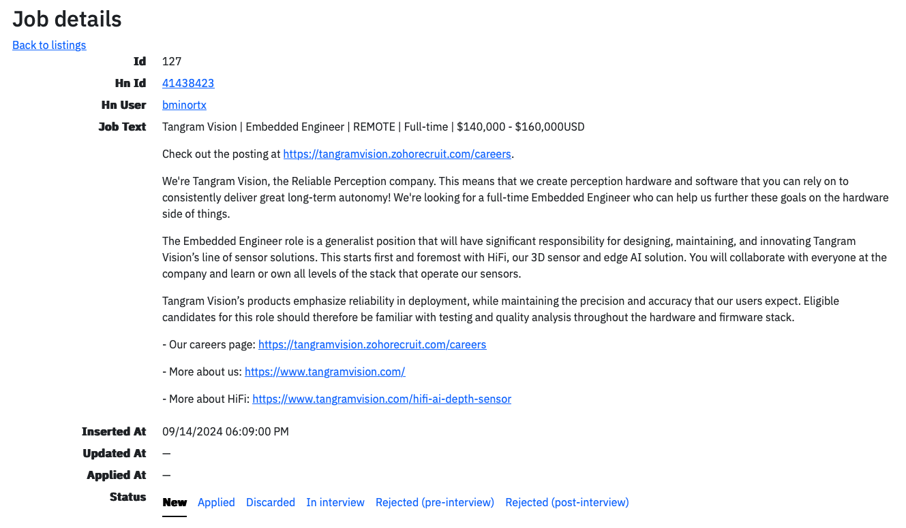

# hn-whoishiring

A FastUI/FastAPI app to manage and interact with Hacker News’s “Who is Hiring” postings.

## Overview

This application allows you to scrape, store, and interactively explore job postings from Hacker News’s “Who is Hiring?” threads. It uses [FastAPI](https://fastapi.tiangolo.com) for the backend, [FastUI](https://github.com/pydantic/FastUI) for the frontend, and [SQLite](https://www.sqlite.org) for data storage.

## Features

 - **Scraping:** Fetch job listings from the “Who is Hiring?” thread on Hacker News.
 - **Storage:** Store job postings in a local SQLite database.
 - **Search & Filter:** Search and filter job postings through a simple web interface.
 - **FastUI Integration:** Provides an interactive UI for managing and exploring the job listings.
 - **Email Extraction:** Automatically extract obfuscated email addresses from job postings and convert them to standard email format.

## Prerequisites

 - Python 3.12+
 - Virtualenv (optional, but recommended)

## Usage

### Create a Virtual Environment and Install Dependencies

```bash
virtualenv venv
source venv/bin/activate

# Install dependencies
pip install -r requirements.txt
```

### Fetch Job Listings

Use the `fetch_job_postings.py` script to scrape and store job postings from the latest “Who is Hiring?” thread. Replace the URL with the current “Who is Hiring?” thread URL.

```bash
python3 src/fetch_job_postings.py --url https://news.ycombinator.com/item?id=41425910
```

You should see an output like
```
$ Database backup created at data/hn_jobs.db_20240914_215948.bak
$ Database already exists
$ 283 new jobs added
```

### Launch the Application
Run the FastAPI server with Uvicorn:

```bash
uvicorn src.app:app
```

Visit [http://127.0.0.1:8000](http://127.0.0.1:8000) in your browser to access the application.




## Contributing

Contributions are welcome! If you’d like to improve this project, please fork the repository and submit a pull request.

## License

This project is licensed under the MIT License.
